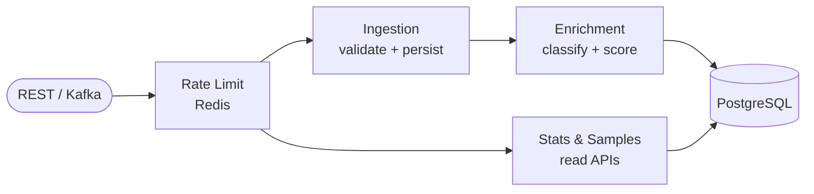

# Mini WSA — Web Security Analytics Pipeline

A simplified Web Security Appliance backend that ingests, enriches, stores, and aggregates security events (DLRs) from a WAF/CDN edge network.

---

## Table of Contents

1. [Architecture](#architecture)
2. [How to Build and Run](#how-to-build-and-run)
3. [API Reference](#api-reference)
4. [Data Generator](#data-generator)
5. [Kafka Streaming Ingestion](#kafka-streaming-ingestion-bonus)
6. [Rate Limiting](#rate-limiting-bonus)
7. [Running the Tests](#running-the-tests)
8. [Storage Choice](#storage-choice)
9. [What I Would Improve](#what-i-would-improve)
10. [Challenges and How I Solved Them](#challenges-and-how-i-solved-them)

---


## Architecture




**Ingestion** accepts single or batched events via `POST /v1/events/ingest` (REST) or from a Kafka topic. Every event is validated, then passed through the enrichment pipeline before being persisted.

**Enrichment** runs two stateless steps: classification (`rule.category` → human-readable `attackType`) and threat scoring (additive formula capped at 100). A third step queries the DB to detect repeat offenders and add a +15 bonus.

**Analytics** exposes two read APIs backed by native SQL aggregations (`JdbcTemplate`) to avoid JPA entity hydration on large result sets.

**Rate Limiting** is enforced by a servlet filter using Redis INCR + EXPIRE per client IP, with tiered limits for write vs. read paths.

### Threat Score Formula

```
score = severityScore   // CRITICAL=40, HIGH=30, MEDIUM=20, LOW=10
      + actionScore     // DENY=20, ALERT=10, MONITOR=0
      + pathBonus       // path contains /admin or /login → +15
      + repeatOffender  // >5 events from same IP in last 10 min → +15
score = min(score, 100)
```

---


## How to Build and Run


### Prerequisites

- Java 21+
- Docker & Docker Compose


### Option A — Full stack via Docker Compose

```bash
docker compose up --build
```

The app starts on `http://localhost:8080`. PostgreSQL, Redis, and Kafka are all included.
The Dockerfile uses a multi-stage build — no local JDK or Maven required.

### Option B — Local development (app only)

Start the infrastructure:

```bash
docker compose up postgres redis kafka -d
```

Run the app:

```bash
./mvnw spring-boot:run
```

---


## API Reference

Full documentation — including all request/response fields, validation rules, and copy-paste curl examples — lives in **[docs/API.md](docs/API.md)**.

Quick reference:

| Method | Path | Description |
|--------|------|-------------|
| `POST` | `/v1/events/ingest` | Ingest one event or a JSON array of events |
| `GET`  | `/v1/stats/summary` | Aggregated analytics over a time window |
| `GET`  | `/v1/events/samples` | Paginated list of raw events with filters |

### Quick start — ingest a single event

```bash
curl -s -X POST http://localhost:8080/v1/events/ingest \
  -H "Content-Type: application/json" \
  -d '{
    "eventId":   "evt-001",
    "timestamp": "2026-07-16T10:00:00Z",
    "configId":  14227,
    "clientIp":  "203.0.113.42",
    "hostname":  "www.example.com",
    "path":      "/admin/login",
    "method":    "POST",
    "rule": {
      "id":       "950001",
      "name":     "SQL_INJECTION",
      "severity": "CRITICAL",
      "category": "INJECTION"
    },
    "action": "DENY"
  }' | jq .
# → {"ingested": 1, "failed": 0, "errors": []}
```

### Quick start — query stats and samples

```bash
# Stats for a tenant over a day
curl -s "http://localhost:8080/v1/stats/summary?\
configId=14227&from=2026-07-16T00:00:00Z&to=2026-07-16T23:59:59Z" | jq .

# Browse recent INJECTION / DENY events
curl -s "http://localhost:8080/v1/events/samples?\
configId=14227&category=INJECTION&action=DENY&limit=10&offset=0" | jq .
```

See [docs/API.md](docs/API.md) for the complete field reference, all enum values, batch ingestion, error payloads, and pagination examples.

---


## Data Generator

Generates realistic traffic and POSTs it to the running app. Uses a two-phase strategy: seeds repeat-offender IPs first, then generates the main event volume with a 30/70 attacker-to-normal ratio.

```bash
# Terminal 1 — app must be running first
./mvnw spring-boot:run

# Terminal 2 — generate 10 000 events (default)
./mvnw spring-boot:run -Dspring-boot.run.profiles=datagen

# Override count
./mvnw spring-boot:run -Dspring-boot.run.profiles=datagen \
  -Dspring-boot.run.jvmArguments="-Ddatagen.count=50000"
```

---


## Kafka Streaming Ingestion (bonus)

Events can be consumed from the `security-events` Kafka topic. Each message is a single JSON event (same schema as the REST body). The consumer feeds into the same `IngestionService` pipeline.

```bash
# Start Kafka (KRaft mode — no ZooKeeper)
docker compose up kafka -d

# Send sample events via the producer script
./produce-events.sh 10
```

The producer script (`produce-events.sh`) generates random events and pipes them to the topic via `kafka-console-producer`.

---


## Rate Limiting (bonus)

Redis-backed per-IP rate limiting enforced by a servlet filter. Tiered limits:


| Endpoint                 | Limit        |
| ------------------------ | ------------ |
| `POST /v1/events/ingest` | 1000 req/min |
| `GET /v1/stats/**`       | 100 req/min  |
| `GET /v1/events/samples` | 100 req/min  |


Returns `429 Too Many Requests` with a `Retry-After: 60` header when exceeded. Fails open if Redis is unavailable.

Test it:

```bash
docker compose up redis -d
./test-rate-limit.sh
```

---


## Running the Tests

Requires Docker (Testcontainers spins up a real PostgreSQL container for the integration test).

```bash
# All tests
./mvnw test

# Unit tests only (no Docker required)
./mvnw test -Dtest="ClassificationServiceTest,ThreatScoringServiceTest,RepeatOffenderDetectionServiceTest,ValidationServiceTest"

# Integration test only
./mvnw test -Dtest="EventIngestionControllerIT"
```

---


## Storage Choice


I chose PostgreSQL as the system's **Single Source of Truth** because it excels in handling **stable, well-defined schemas** while providing industrial-grade reliability:

- **ACID Compliance:** Ensures absolute data integrity and idempotency, preventing duplicates during ingestion.
- **Performance:** Native support for `TIMESTAMPTZ` and complex indexing allows for efficient, low-latency time-range queries without ORM overhead.
- **Flexibility:** Native `JSONB` support provides the schema-flexibility of NoSQL when needed, without sacrificing relational power.
- **Operational Simplicity:** A single robust database reduces infrastructure complexity, minimizes data synchronization issues, and leverages mature tooling for backups and migrations.

**Indexes** on `(config_id, event_timestamp)`, `(client_ip, received_at)`, `(rule_category, event_timestamp)`, and `(action, event_timestamp)` keep all query paths efficient.


**Tradeoff vs. alternatives:** 

- **Alternative (NoSQL/Document Stores):** While NoSQL offers schemaless flexibility, PostgreSQL’s `JSONB` gives me that same flexibility while maintaining relational guarantees (ACID, JOINs, and complex indexing).
- **Alternative (Time-Series DBs like ClickHouse/Timescale):** While ClickHouse would outperform at 100M+ row aggregations, it introduces operational and dialect complexity that is disproportionate to the current scope. I opted for PostgreSQL’s mature ecosystem, which handles our current load efficiently.

---


## What I Would Improve

- **True sliding-window rate limiting** — I am currently using a Fixed Window rate limiter, which resets the counter at the start of every minute. This creates a vulnerability where an attacker can double their request quota by 'bursting' at the end of one minute and the beginning of the next.
To fix this, I am upgrading to a Sliding Window approach using Redis Sorted Sets. This tracks the exact timestamp of every request, allowing me to calculate the request rate over any continuous 60-second window. This provides perfect accuracy and completely eliminates the risk of burst attacks.
- **Atomic INCR+EXPIRE via Lua script** — the current rate-limit filter issues `INCR` and `EXPIRE` as two separate Redis commands. If the app crashes or the network drops between them, the key is created but its TTL is never set, permanently blocking that IP until manual cleanup. The fix is to replace both calls with a single Lua script executed atomically on the Redis server: `redis.call('INCR', key)` followed by a conditional `redis.call('EXPIRE', key, ttl)` — Redis guarantees a Lua script runs as one uninterruptible unit, closing the gap entirely.
- **Repeat-offender detection at scale** — the current `COUNT(*)` DB query adds one extra round-trip per ingested event. At high throughput this would become a bottleneck. Replacing it with a Redis sorted set (event timestamps per IP, trimmed by time) would give O(log n) in-memory lookups.
- **Stats aggregation at scale** — live SQL aggregations over a growing table will slow beyond ~10M rows. Scheduled rollup tables or TimescaleDB continuous aggregates would keep query latency flat.
- **Dead-letter queue for Kafka** — currently malformed or invalid Kafka messages are logged and dropped. A DLQ topic would allow replaying or inspecting failed messages.
- **Observability** — structured logging is in place, but adding Micrometer metrics (ingest throughput, enrichment latency, cache hit rate) and a health endpoint would make the system production-ready.

---

## Challenges and How I Solved Them

**Isolating the data generator with a Spring profile.** The data generator is a load-testing utility — it should never activate in production or during tests. Rather than adding conditional logic to the main application, I used a dedicated `datagen` Spring profile. Any bean annotated with `@Profile("datagen")` is only instantiated when that profile is active, so the generator is completely invisible to the normal application context. This also allowed configuring the datagen profile with its own `application-datagen.yml` (headless mode, custom counts, target URL) without polluting the main configuration. The result is a clean separation: one codebase, two completely independent runtime behaviours, activated by a single flag.

**Database indexes designed around query access patterns.** The analytics queries have predictable, high-frequency access patterns, so indexes were designed specifically for each one rather than added generically. The stats and samples time-range queries filter by `(config_id, event_timestamp)` — the composite index on those two columns lets PostgreSQL skip full table scans entirely and go straight to the matching rows. Repeat-offender detection queries by `(client_ip, received_at)`, so that gets its own index to keep the per-event `COUNT(*)` fast. Category and action filters each get a composite index with `event_timestamp` so they support both filtering and time-range scoping in a single index scan. Without these indexes, every stats query would be a sequential scan across the full table — acceptable at 10K rows, unacceptable at 10M.

**Distributed load protection and DDoS resilience.** The system needed to handle ingestion spikes and prevent potential DDoS attacks without overwhelming the database. A memory-based rate limiter would not work in a multi-instance deployment, and using the primary DB for counter storage would create a performance bottleneck under the exact conditions where protection is most needed. I implemented a distributed rate limiter using Redis atomic operations: `INCR` increments a per-IP counter and `EXPIRE` sets a 60-second TTL on first use, creating a self-resetting fixed window with no cleanup job required. The filter runs before any business logic or DB access, so abusive traffic is rejected at the edge of the application. Redis is the right tool here — it is purpose-built for ephemeral, write-heavy, shared-state operations and keeps the rate-limit counters entirely off the primary database.

**Separating analytics time from ingestion time.** Maintaining two timestamps — `event_timestamp` (client-reported) and `received_at` (server-assigned) — was a deliberate design decision with real correctness implications. If analytics filtered by `received_at`, backdated events would appear in the wrong time window. If repeat-offender detection used `event_timestamp`, an attacker could bypass the +15 bonus by spreading event timestamps across the past hour. Keeping them separate, and building different indexes for each access pattern, was the only design that satisfied both requirements correctly.